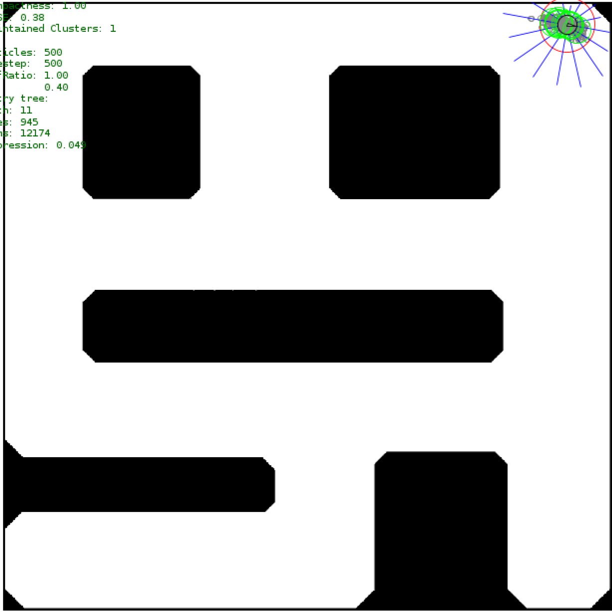

# Robotics Simulation Data
| Square environment | Maze environment |
|---------|---------|
|  |  |
Simulated robotics data from a PF diversity maintenance experiment for reproducibility.

The data aims to replicate the data used in ["Tackling the premature convergence problem in Monte-Carlo localization"](https://www.sciencedirect.com/science/article/pii/S0921889009000918) (2009) by Kootstra et al., published in Robotics and Autonomous systems. This exact data (50 first trajectories) is used in "Ancestry Tree Clustering for Particle Filter Diversity Maintenance" (2025) by Vallivaara et al., to be published at the IPIN 2025 conference.

## Data description
The csv files (`data/`) from Square (ambiguous) and Maze (unambiguous) environments contain 100 trajectories each. The trajectories are generated by driving the robot around with a Braitenberg-like controller and separated by random-length driving followed by a random direction flip with 50% probability.

### Environments
The pix_to_meter scale for the images is 15.0/675.0. We use a scaled  version of the original paper for more "metric" and interpretable units. The scaling factor is 0.1 (i.e. Kootstra's 150 units => 15 meters).

### Columns
`run_index` - trajectory number
`timestep` - discrete time step from 0 to 499 for each trajectory
`true_x` - Ground truth x coordinate
`true_y` - Ground truth y coordinate
`true_theta` - Ground truth heading
`control_x` - Robot control in x direction
`control_y` - Robot control in y direction
`control_theta` - Robot control in heading (followed by transition)
`lidar_readings` - Array of 16 lidar distance measurements in CCW order, starting from -pi (back of the robot)
