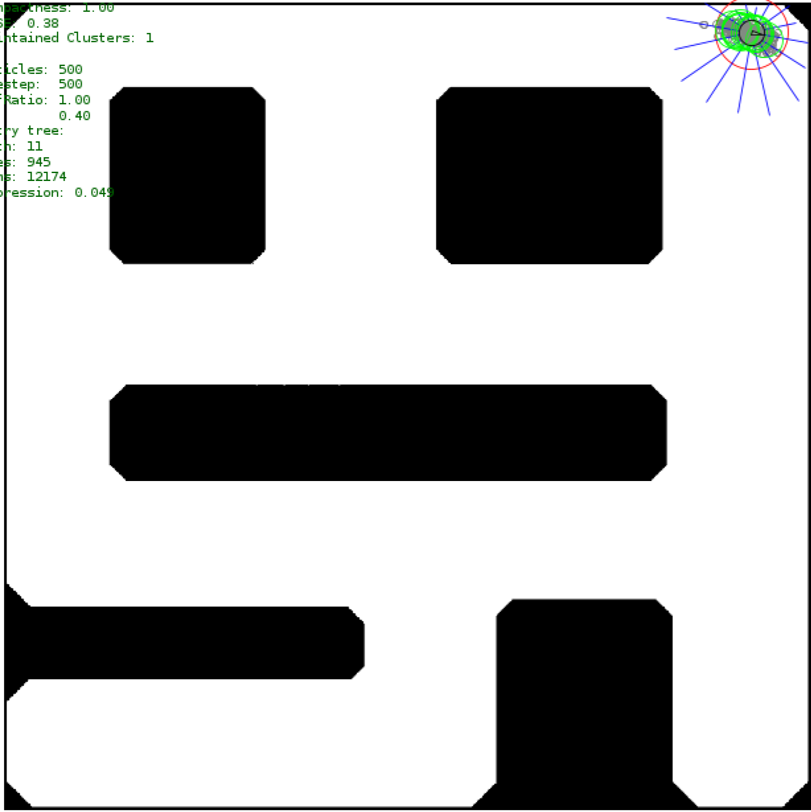
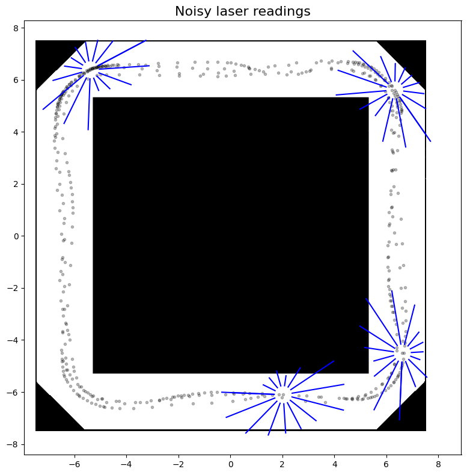

# Robotics simulation data for PF diversity maintenance in multimodal environments
| Square environment | Maze environment |
|---------|---------|
|  |  |

Simulated robotics data from a PF diversity maintenance experiment for reproducibility. The data aims to replicate the data used in ["Tackling the premature convergence problem in Monte-Carlo localization"](https://www.sciencedirect.com/science/article/pii/S0921889009000918) (2009) by Kootstra et al., published in Robotics and Autonomous systems. This exact data (50 first trajectories) is used in "Ancestry Tree Clustering for Particle Filter Diversity Maintenance" (2025) by Vallivaara et al., to be published at the IPIN 2025 conference.

## Data description
The csv files (`data/`) from Square (multimodal, ambiguous) and Maze (unimodal, unambiguous) environments contain 100 trajectories each. The trajectories are generated by driving the robot around with a Braitenberg-like controller and separated by random-length driving followed by a random direction flip with 50% probability. In addition to GT, the data includes noisy control (translation followed by rotation) and noisy lidar readings, measuring the distance to closest obstracle in the ray direction.

### Environments
The pix_to_meter scale for the images is 15.0/675.0 ~ 0.02222. We use scaled versions of the original paper's environments for more "metric" and interpretable units. The scaling factor is 0.1 (i.e. Kootstra's 150 units => 15 meters).

### Robot:
The robot if a differential-drive circular robot with a radius of 0.35 (m). The laser rays are cast from the edge of the robot.

### Columns
`run_index` - trajectory number  
`timestep` - discrete time step from 0 to 499 for each trajectory  
`true_x` - Ground truth x coordinate  
`true_y` - Ground truth y coordinate  
`true_theta` - Ground truth heading  
`control_x` - Robot control in x direction 
`control_y` - Robot control in y direction 
`control_theta` - Robot control in heading 
`lidar_readings` - Array of 16 lidar distance measurements in CCW order, starting from -pi (back of the robot)

## Exploring the data
A Python Notebook `/notebooks/explore_trajectories.ipyb` illustrates basic data usage:

| Odometry | Lidar readings |
|---------|---------|
|  |  |
